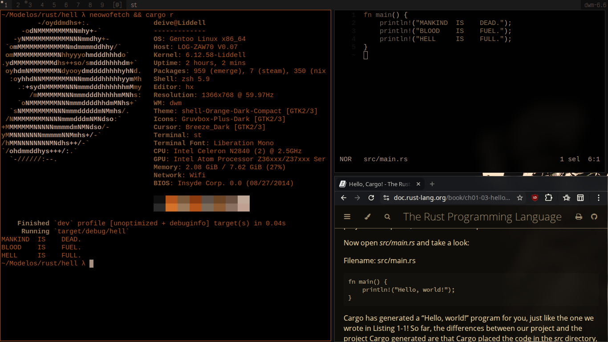
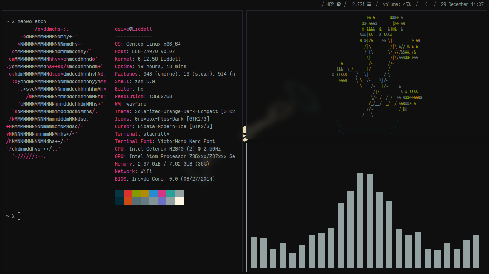
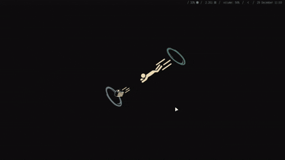

# Σ | My Dotfiles 
*"My personal customization files :)"*

  
  
    
  
  
  
    
  

---

## 🛠️ | Dependencies

- **Window Manager:** Wayfire | [DWM](https://github.com/HavanaHL/wm-dotfiles/tree/main/Solarized%20/DWM/dwm)
- **Terminal:** Alacritty | [ST](https://github.com/HavanaHL/wm-dotfiles/tree/main/Solarized%20/DWM/st)
- **Launcher:** Fuzzel | [Dmenu](https://github.com/HavanaHL/wm-dotfiles/tree/main/Solarized%20/DWM/dmenu)
- **Bar:** Waybar
- **Notifications:** Dunst
- **Editor:** Helix
- **Multiplexer:** Zellij
- **Screenshot:** Grim & Slurp | Maim

## 🎨 | Themes

  
<strong>🌊 Kanagawa Wave</strong>

 
     
  
  
     
  
  - [**Alacritty**](https://github.com/HavanaHL/wm-dotfiles/tree/main/Kanagawa/alacritty)
  - [**Dunst**](https://github.com/HavanaHL/wm-dotfiles/tree/main/Kanagawa/dunst)
  - [**Fuzzel**](https://github.com/HavanaHL/wm-dotfiles/tree/main/Kanagawa/fuzzel) 
  - [**Helix**](https://github.com/HavanaHL/wm-dotfiles/tree/main/Kanagawa/helix)
  - [**Waybar**](https://github.com/HavanaHL/wm-dotfiles/tree/main/Kanagawa/waybar)
  - [**Wayfire**](https://github.com/HavanaHL/wm-dotfiles/tree/main/Kanagawa/wayfire)
  - [**Zellij**](https://github.com/HavanaHL/wm-dotfiles/tree/main/Kanagawa/zellij)

  
<strong>🏭 Industrial</strong>

 
     
  
  
     
  
  - [**Alacritty**](https://github.com/HavanaHL/wm-dotfiles/tree/main/Industrial/alacritty)
  - [**Dunst**](https://github.com/HavanaHL/wm-dotfiles/tree/main/Industrial/dunst)
  - [**DWM**](https://github.com/HavanaHL/wm-dotfiles/tree/main/Industrial/DWM)
  - [**Fuzzel**](https://github.com/HavanaHL/wm-dotfiles/tree/main/Industrial/fuzzel) 
  - [**Helix**](https://github.com/HavanaHL/wm-dotfiles/tree/main/Industrial/helix)
  - [**Waybar**](https://github.com/HavanaHL/wm-dotfiles/tree/main/Industrial/waybar)
  - [**Wayfire**](https://github.com/HavanaHL/wm-dotfiles/tree/main/Industrial/wayfire)
  - [**Zellij**](https://github.com/HavanaHL/wm-dotfiles/tree/main/Industrial/zellij)

  
<strong>☀️ Solarized</strong>

 
     
  
  
     
  
  - [**Alacritty**](https://github.com/HavanaHL/wm-dotfiles/tree/main/Solarized%20/alacritty)
  - [**Dunst**](https://github.com/HavanaHL/wm-dotfiles/tree/main/Solarized%20/dunst)
  - [**DWM**](https://github.com/HavanaHL/wm-dotfiles/tree/main/Solarized%20/DWM)
  - [**Fuzzel**](https://github.com/HavanaHL/wm-dotfiles/tree/main/Solarized%20/fuzzel) 
  - [**Helix**](https://github.com/HavanaHL/wm-dotfiles/tree/main/Solarized%20/helix)
  - [**Waybar**](https://github.com/HavanaHL/wm-dotfiles/tree/main/Solarized%20/waybar)
  - [**Wayfire**](https://github.com/HavanaHL/wm-dotfiles/tree/main/Solarized%20/wayfire)
  - [**Zellij**](https://github.com/HavanaHL/wm-dotfiles/tree/main/Solarized%20/zellij)

